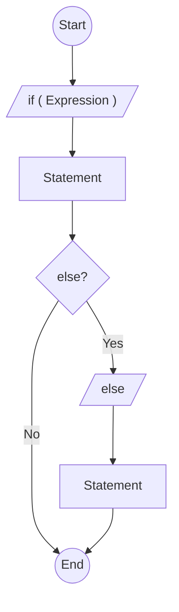

# Лабораторная 1 - Матиевский Павел

## 1. Идентификатор языка С
\<letter\>    ::= "a"..."z" | "A"..."Z" | "_"

\<digit\>     ::= "0"..."9"

\<identifier\> ::= \<letter\> { \<letter\> | \<digit\> }

## 2. Константа типа float языка С
\<digit\>       ::= "0"..."9"

\<unsigned_int\>::= \<digit\> { \<digit\> }

\<sign\>        ::= "+" | "-"

\<exponent\>    ::= ("e" | "E") [\<sign\>] \<unsigned_int\>

\<float_const\> ::= \<unsigned_int\> "." [\<unsigned_int\>] [\<exponent\>] | "." \<unsigned_int\> [\<exponent\>] | \<unsigned_int\> \<exponent\>

## 3. Объявление переменных типа int
Идентификатор – последовательность из букв и цифр, начинается с буквы, не более 4 символов. Возможна инициализация переменной десятичной или восьмеричной константой (не более 3 цифр).

\<letter\>      ::= "a"..."z" | "A"..."Z" | "_"

\<digit\>       ::= "0"..."9"

\<oct_digit\>   ::= "0"..."7"

---
\<char\>        ::= \<letter\> | \<digit\>

\<short_id\>    ::= \<letter\> [ \<char\> [ \<char\> [ \<char\> ] ] ]

---
\<dec_const\>   ::= \<digit\> [ \<digit\> [ \<digit\> ] ]

\<oct_const\>   ::= "0" [ \<oct_digit\> [ \<oct_digit\> ] ]

<init_part>   ::= "=" ( <dec_const> | <oct_const> )

<decl_int>    ::= "int" <short_id> [ <init_part> ] ";"

## 4. Арифметическое выражение
Операнды: идентификаторы, целые десятичные константы. Операции: бинарные (+, -, *, /), унарные (+, -). Возможно использование круглых скобок. Тут использую БНФ

\<expression\> ::= \<term\> | \<expression\> "+" \<term\> | \<expression\> "-" \<term\>

\<term\> ::= \<factor\> | \<term\> "*" \<factor\> | \<term\> "/" \<factor\>

\<factor\> ::= \<identifier\> | \<decimal_const\> | "(" \<expression\> ")" | "+" \<factor\> | "-" \<factor\>

## 5. Оператор присваивания

\<assign_op\> ::= \<identifier\> "=" \<expression\> ";"

## 6. Вызов функции

\<arg_list\>  ::= \<expression\> { "," \<expression\> }

\<func_call\> ::= \<identifier\> "(" [ \<arg_list\> ] ")" ";"

## 7. Объявление функции

\<type\>    ::= "int" | "float" | "void" | \<identifier\>

\<param\>      ::= \<type\> \<identifier\>

\<param_list\> ::= \<param\> { "," \<param\> }

\<func_decl\>  ::= \<type\> \<identifier\> "(" [ \<param_list\> ] ")" "{" \<block\> "}"

## 8. Инструкция выбора if (диаграмма)

